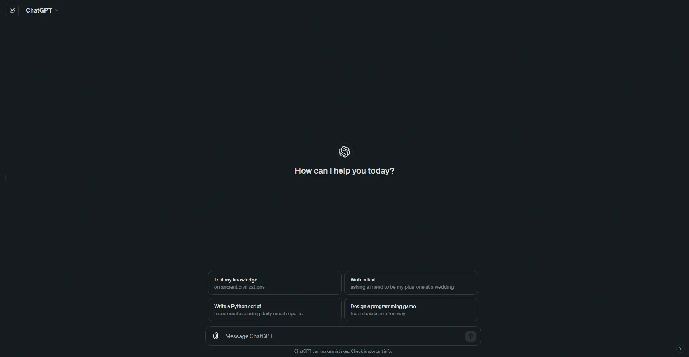

 

 

<h1 align="center">Everblush</h1> 
<h4 align="center">
    <i>A Dark, Vibrant and Beatiful colorscheme for <a href="https://chat.openai.com/">ChatGPT</a>
    </i>
</h4>

	

  

## 🧑‍🤝‍🧑 Credits

- [Everblush](https://github.com/Everblush) - A Dark and Beautiful and Vibrant Colorscheme
- [Catppuccin](https://github.com/catppuccin) - Base styles CSS and Stylus theme