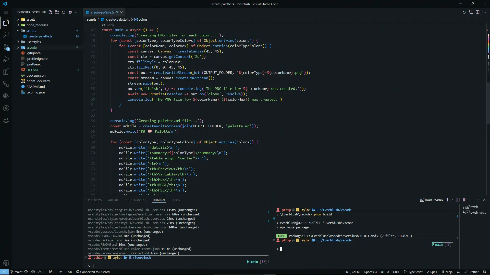

<div align="center">
 
</div>

<h1 align="center">Everblush</h1> 
<h4 align="center"><i>A Dark, Vibrant and Beatiful colorscheme for <a href="https://code.visualstudio.com/">VSCode</a></i></h4>

<p align="center">
  
</p>

## Build

To install you need to clone this repository to your computer and then run the following commands.

1. Clone this repository to your computer.

```bash
git clone https://github.com/Zylo23/Everblush.git
```

2. Navigate to the `vscode` directory.

```bash
cd Everblush/vscode
```

3. Install dependencies.

```bash
npm i -g vsce
```

4. Build the `.vsix` file.

```bash
npm run build
```

This command will create a `.vsix` file in the `vscode` directory.

## Install the theme

Before installing the theme, you need to have [VSCode](https://code.visualstudio.com/) installed and build the theme as [described above](#build).

1. Open VSCode.
2. Open the Command Palette (`Ctrl+Shift+P` on Windows/Linux or `Cmd+Shift+P` on macOS).
3. Type `Extensions: Install from VSIX...` and select it.
4. Select the `.vsix` file you created in the `vscode` directory.

Following the steps above will install the theme.

## Credits

- [Everblush](https://github.com/Everblush) - A Dark and Beautiful and Vibrant Colorscheme (for Colorschemer)
